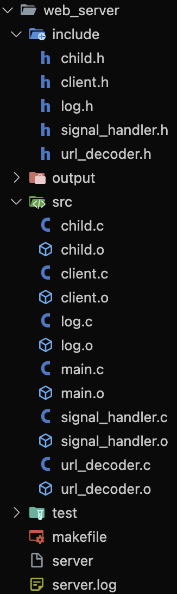
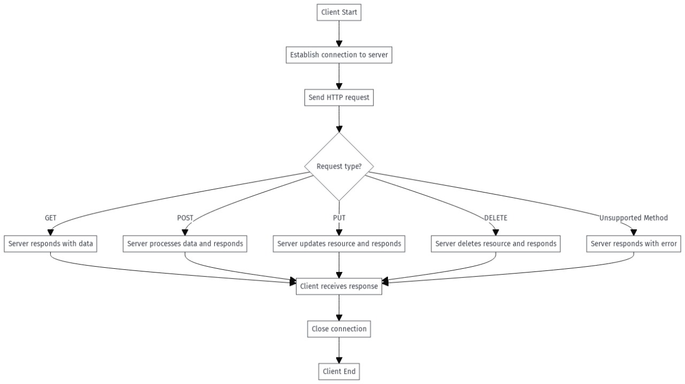
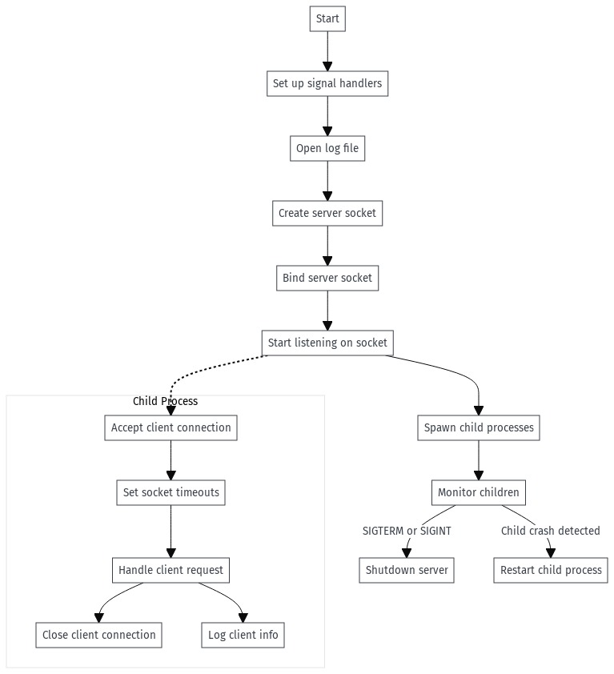

# HTTP Server Project 🚀

Proyek ini mengimplementasikan server HTTP sederhana menggunakan bahasa C. Server ini mendukung fungsionalitas seperti routing, parsing parameter, dan penyajian file statis.

---

## Badges


---

## Daftar Isi


1. [Persiapan Awal 🛠️](#persiapan-awal)
    - [Prasyarat ⚙️](#prasyarat)
    - [Instalasi 💾](#instalasi)
2. [Visualisasi Repositori 📊](#visualisasi-repositori)
3. [Menjalankan Unit Test 🧪](#menjalankan-unit-test)
4. [Struktur File 📁](#struktur-file)
5. [Penanganan Request HTTP 📡](#penanganan-request-http)
6. [Fitur 🌟](#fitur)
7. [Alur Program 🌀](#alur-program)
8. [Penulis ✍️](#penulis)

---

---

## Persiapan Awal 🛠️

### Prasyarat ⚙️

1. Windows Subsystem for Linux (WSL) (Opsional untuk pengguna Windows).
2. GCC Compiler.

### Instalasi 💾

1. **Install WSL (Opsional):**
    - [Panduan Install WSL](https://learn.microsoft.com/en-us/windows/wsl/install)

2. **Clone Repositori:**
    ```bash
    git clone https://github.com/username/repository.git
    cd repository
    ```

3. **Build Proyek:**
    ```bash
    make
    ```

4. **Jalankan Server:**
    ```bash
    ./server
    ```

## Visualisasi Repositori 📊
Berikut adalah visualisasi repositori proyek ini.

---

## Struktur File 📁

- `server.c`: Titik masuk utama server. Bertanggung jawab untuk menangani koneksi klien, parsing request, dan dispatching request ke fungsi handler yang sesuai.
- Struktur folder:
  

  ## Struktur File

### 1. `child.c`

#### Fungsi:
Mengelola proses anak yang menerima dan memproses koneksi dari klien.

#### Proses:
- **`spawn_child`**: Membuat proses anak menggunakan `fork()`.
- **`child_process`**: Menangani permintaan klien pada proses anak, menerima koneksi dan memprosesnya.
- **`monitor_children`**: Memantau proses anak untuk memastikan jika salah satu mati, proses tersebut akan di-restart.

### 2. `log.c`

#### Fungsi:
Mengelola pencatatan log aplikasi.

#### Proses:
- **`log_init`**: Inisialisasi file log.
- **`log_close`**: Menutup file log setelah digunakan.
- **`log_message`**: Mencatat pesan ke file log dengan timestamp dan PID.

### 3. `signal_handler.c`

#### Fungsi:
Menangani sinyal SIGTERM dan SIGINT untuk menghentikan server secara aman.

#### Proses:
- **`signal_handler`**: Menangani sinyal yang diterima, mengubah status variabel `keep_running` untuk mengakhiri server.

### 4. `client.c`

#### Fungsi:
Mengelola komunikasi dengan klien.

#### Proses:
- **`handle_client`**: Menerima permintaan dari klien, memprosesnya, dan mengirim respons kembali ke klien.

### 5. `url_decoder.c`

#### Fungsi:
Mendecode URL yang diterima dari klien.

#### Proses:
- **`url_decode`**: Mengubah URL yang di-encode (misalnya, mengganti `%20` dengan spasi) menjadi bentuk yang dapat dibaca.

### 6. `main.c`

#### Fungsi:
Titik awal dari server, menginisialisasi server socket, menangani sinyal, dan mengelola proses anak.

#### Proses:
- Membuat socket server dan mengikatnya ke alamat IP dan port.
- Menangani koneksi yang masuk dengan mendengarkan permintaan dari klien.
- Membuat dan memantau proses anak untuk menangani koneksi dari klien.
- Menghentikan server dengan aman saat menerima sinyal.

---

## Alur Koneksi Klien

Berikut adalah diagram alur koneksi klien ke server:


### Penjelasan Alur Koneksi Klien Berdasarkan Gambar

1. **Client Start**: Proses dimulai ketika klien memulai operasi dan bersiap untuk melakukan komunikasi dengan server.
2. **Establish Connection to Server**: Klien membuat koneksi ke server melalui protokol tertentu, seperti TCP, untuk memungkinkan pengiriman permintaan HTTP.
3. **Send HTTP Request**: Klien mengirimkan permintaan HTTP ke server. Permintaan ini dapat berupa metode HTTP seperti GET, POST, PUT, atau DELETE.
4. **Request Type?**: Server memeriksa jenis permintaan yang dikirimkan oleh klien dan menentukan tindakan yang sesuai:
    - **GET**: Server mengembalikan data yang diminta oleh klien.
    - **POST**: Server memproses data yang dikirim oleh klien, biasanya untuk membuat atau memodifikasi data pada server, lalu memberikan respons.
    - **PUT**: Server memperbarui sumber daya berdasarkan data yang dikirim oleh klien dan memberikan respons.
    - **DELETE**: Server menghapus sumber daya yang diminta klien dan memberikan respons.
    - **Unsupported Method**: Jika metode permintaan tidak dikenali atau tidak didukung, server mengembalikan pesan kesalahan.
5. **Client Receives Response**: Klien menerima respons dari server, baik berupa data, konfirmasi keberhasilan, atau pesan kesalahan, tergantung pada jenis permintaan.
6. **Close Connection**: Setelah proses komunikasi selesai, koneksi antara klien dan server ditutup.
7. **Client End**: Proses selesai dan klien berhenti beroperasi.

**Catatan**:
- Setiap jenis permintaan (GET, POST, PUT, DELETE) memiliki fungsi spesifik yang ditangani oleh server.
- Penanganan kesalahan (error handling) terjadi jika server tidak mendukung metode yang diminta klien, yang biasanya menghasilkan kode status HTTP seperti 405 Method Not Allowed.

---

## Proses Server

Berikut adalah diagram proses server:


### Alur Utama Server

1. **Start**: Proses dimulai dengan inisialisasi server.
2. **Set Up Signal Handlers**: Server mengatur handler untuk menangani sinyal seperti SIGTERM atau SIGINT, memungkinkan server untuk melakukan shutdown dengan bersih ketika menerima sinyal penghentian.
3. **Open Log File**: Membuka file log untuk mencatat aktivitas server, seperti permintaan klien atau kesalahan.
4. **Create Server Socket**: Membuat socket server yang bertindak sebagai endpoint untuk menerima koneksi dari klien.
5. **Bind Server Socket**: Socket server diikat ke alamat dan port tertentu sehingga klien dapat menghubunginya.
6. **Start Listening on Socket**: Server mulai mendengarkan koneksi klien pada port yang ditentukan.

### Proses Anak (Child Process)

Ketika klien terhubung, server membuat proses anak untuk menangani koneksi tersebut. Alur ini mencakup:
1. **Accept Client Connection**: Proses anak menerima koneksi klien menggunakan socket yang disediakan oleh server.
2. **Set Socket Timeouts**: Proses anak mengatur waktu timeout untuk koneksi klien agar tidak menggantung terlalu lama.
3. **Handle Client Request**: Permintaan klien diproses (misalnya, membaca data dari klien, menulis respons).
4. **Log Client Info**: Informasi klien (seperti alamat IP dan port) dicatat ke dalam file log.
5. **Close Client Connection**: Setelah permintaan klien selesai diproses, koneksi dengan klien ditutup.

### Manajemen Proses Anak

Proses utama server juga menangani proses anak untuk menjaga stabilitas server:
1. **Spawn Child Processes**: Server membuat beberapa proses anak (fork) untuk menangani klien secara paralel.
2. **Monitor Children**: Proses utama memantau proses anak untuk mendeteksi jika ada yang berhenti atau crash:
    - **SIGTERM atau SIGINT**: Jika server menerima sinyal penghentian, server menghentikan semua proses anak dan melakukan shutdown bersih.
    - **Child Crash Detected**: Jika salah satu proses anak mati, server membuat ulang proses anak tersebut agar tetap tersedia untuk melayani klien.

### Ringkasan Alur

- Proses utama server bertugas mendengarkan koneksi dan mengelola proses anak.
- Proses anak bertanggung jawab untuk menangani setiap koneksi klien secara individu.
- Jika ada gangguan (misalnya sinyal penghentian atau proses anak crash), proses utama bertindak untuk menangani atau memulihkan situasi tersebut.

---

## Penanganan Request HTTP 📡

Server ini mendukung pengujian metode HTTP menggunakan `curl` untuk mengirim request ke server yang berjalan.

### Metode GET
Contoh:
```bash
curl http://localhost:8081
```

### Metode POST
Contoh:
```bash
curl -X POST http://localhost:8081 -d "key=value"
```


### Metode DELETE
Contoh:
```bash
curl -X DELETE http://localhost:8081 -d "key=value"
```

---

## Fitur 🌟

- **Metode HTTP:** Mendukung empat metode HTTP dasar yaitu `GET`, `POST`, `PUT`, dan `DELETE`.
- **Logging:** 
  - Mencatat aktivitas server seperti pemrosesan permintaan, pengiriman respons, serta informasi klien (alamat IP dan port).
  - Mencatat timestamp, PID (Process ID), dan informasi klien untuk setiap koneksi.
  - Log dicatat ke dalam file `server.log`.
- **Multiprocessing:** 
  - Menggunakan proses anak (fork) untuk menangani banyak klien secara paralel.
  - Server membatasi jumlah proses anak dengan `NUM_CHILDREN` yang didefinisikan dalam kode.
  - Setiap proses anak menangani koneksi klien secara independen untuk meningkatkan kinerja.
- **Backlog:** 
  - Menggunakan opsi `BACKLOG` untuk menentukan antrian koneksi yang belum diterima.
  - Server mendengarkan pada port yang ditentukan (`PORT = 8080`).
- **Timeout Koneksi:** 
  - Mengatur timeout untuk setiap koneksi klien dengan `setsockopt()` pada socket.
  - Timeout diterapkan pada pengiriman dan penerimaan data.
- **URL Decoding:** 
  - Menangani decoding URL untuk mengonversi karakter-karakter yang dienkode (seperti `%20` menjadi spasi).
- **Graceful Shutdown:** 
  - Menangani sinyal `SIGTERM` dan `SIGINT` untuk melakukan shutdown yang bersih.
  - Proses anak akan diberhentikan secara tepat saat server dihentikan.

